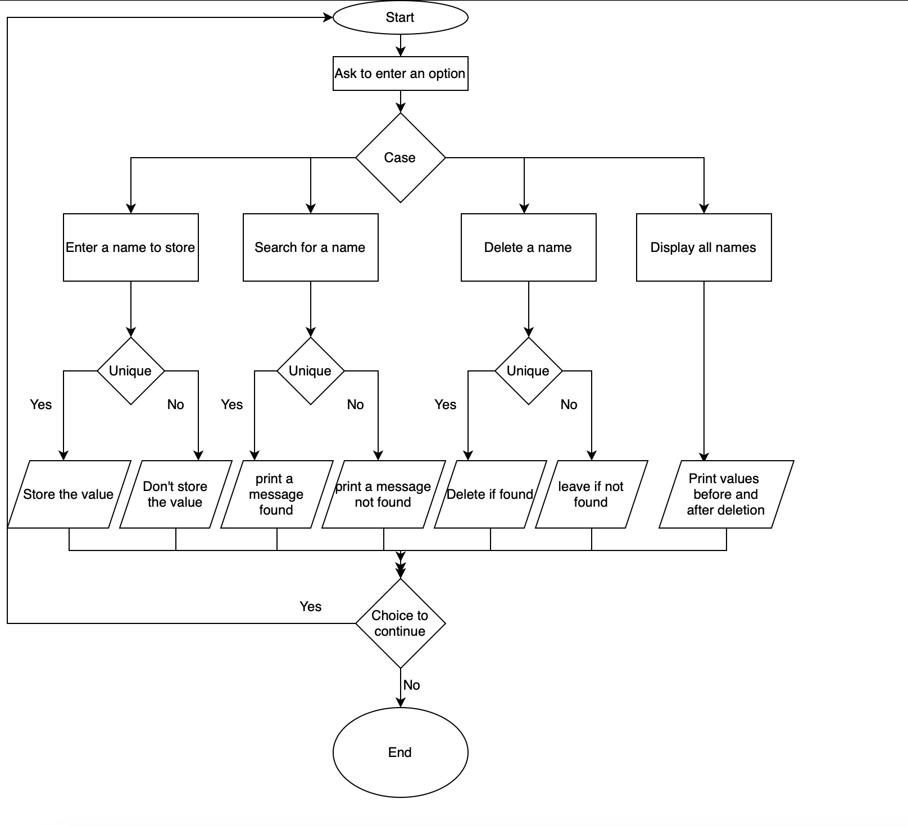

User will be ask to choose a option from the 4 listed options
1. Enter Name
2. Search a Name
3. Delete a Name
4. Print all Names

If the user choose "1" then the user will be asked to enter a name, If the name is not present in the array then it will accept the name and stores in the array.

If the user choose "2" then the user will be asked to enter the name to search. If the name is found then it will print "The name is in the list." else it will print "The name is not in the list."

If the user choose "3" then the user will be asked to enter a name to delete from the list. If the name is found then it will delete the list

If the user choose "4" then it will print the all the names in the list before and after deletion.

To Run the file:
1. Save the java file
2. type the commang "javac filename.java" in the terminal
3. then type "java filename" in the terminal.

The output of the program looks like: 
What do you want to perform:  
1. Enter Name
2. Search a Name
3. Delete a Name
4. Print all Names 
1 
Enter a name:  
chandu 
 
Do you want to contiue, press y for yes!  
y 
What do you want to perform: 
1. Enter Name
2. Search a Name
3. Delete a Name
4. Print all Names 
1 
Enter a name:  
Hari 
 
Do you want to contiue, press y for yes! 
y 
What do you want to perform: 
1. Enter Name
2. Search a Name
3. Delete a Name
4. Print all Names 
1      
Enter a name:  
Vaishu  
 
Do you want to contiue, press y for yes! 
y 
What do you want to perform: 
1. Enter Name
2. Search a Name
3. Delete a Name
4. Print all Names 
2 
Enter a name you want to search: 
chandu 
The name is in the list. 
 
Do you want to contiue, press y for yes! 
y 
What do you want to perform: 
1. Enter Name
2. Search a Name
3. Delete a Name
4. Print all Names 
2 
Enter a name you want to search: 
priya 
The name is not in the list. 
 
Do you want to contiue, press y for yes! 
y 
What do you want to perform: 
1. Enter Name
2. Search a Name
3. Delete a Name
4. Print all Names 
3 
Enter a name you want to remove:  
chandu 
 
Do you want to contiue, press y for yes! 
y 
What do you want to perform: 
1. Enter Name
2. Search a Name
3. Delete a Name
4. Print all Names 
4 
Printing all names in the list. 
chandu Hari Vaishu   
Printing the names after deletion: 
Hari Vaishu   
Do you want to contiue, press y for yes! 
n 

The flow chart of the problem is stated below: 
 