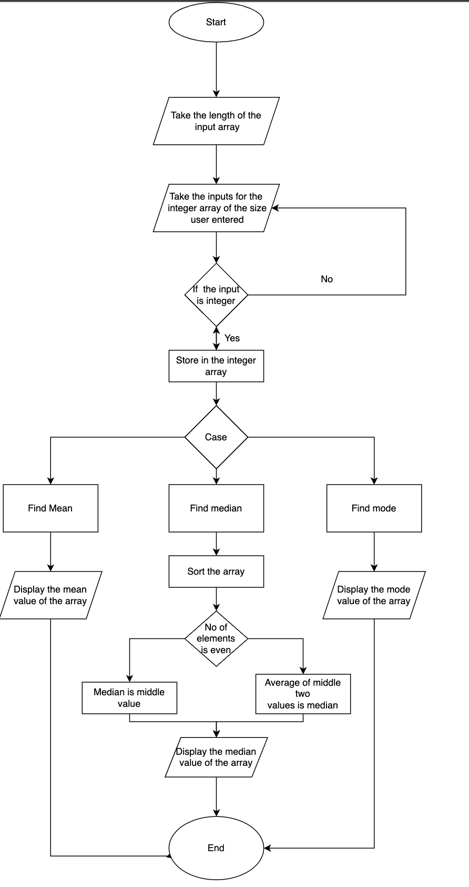

QUESTION:
Create a java program that performs the following operation: 
The program should collect an integer array from the user 
After the array is entered, you need to create a menu of items 
Find the Mean Value 
Find the Median Value 
Find the Mode Value  
From the user-given array. 
The program should have a minimum of 3 functions apart from the main function; each of the functions implements the Mean, Median, and Mode computation by accepting the array user has entered as a parameter and returning the value as a result. From the main method, you will display the result. 

ANSWER: 

1. Ask the User to enter the length of the integer array he want to create. 
2. Create an array of the user entered length. 
3. Take inputs from the user to fill the integer array. 
4. Display the 3 operation Mean, Median, Mode. 
5. Ask User to enter his choice from the above three operations.  
6. If the user chooses mean, then call the meanvalue function which calculates mean of the integer array using the formula of 
   (sum of observations) / (total number of observations) 
7. If the user chooses median, then call the medianvalue function which will operate as follows: 
   1. It will sort the array
   2. Checks the length of the array
   3. If the value is odd then the middle value is the median and if the length of the array is even then the median is the average of the two middle values.
8. If the user chooses mode, then call the modevalue function which will operate as follows:
   1. Intialise maxcount and maxvalue to zero
   2. Now run a loop where each element will be checked with every element of the array,
   3. which element is repeated for more number of times will be assigned to the maxvalue and the particular count will be assigned to the max count.
   4. Now after the execution of loops the final maxvalue will be the median value.
9. Now the program ends.

TO EXECUTE:
Open Terminal/Command prompt and enter the following commands. 
1. javac Lab3.java
2. java Lab3

OUTPUT:
1. Execution of Mean option:

WELCOME!!!!!!!! 
*************** 
Enter the size of your integer array:  
5 
Enter 1 value: 
10 
Enter 2 value: 
20 
Enter 3 value: 
40 
Enter 4 value: 
50 
Enter 5 value: 
70 
***************************************** 

Your Integer Array is : 
10 20 40 50 70  
***************************************** 

OPERATIONS: 
1. MEAN
2. MEDIAN
3. MODE

Enter your choice:  
1 
The mean value is:  
38 
THANK YOU!!! 
************ 

2. Execution of Median option:

EVEN: 
WELCOME!!!!!!!! 
*************** 
Enter the size of your integer array:  
6 
Enter 1 value: 
5 
Enter 2 value: 
2 
Enter 3 value: 
4 
Enter 4 value: 
8 
Enter 5 value: 
1 
Enter 6 value: 
2 
***************************************** 

Your Integer Array is : 
5 2 4 8 1 2  
***************************************** 

OPERATIONS: 
1. MEAN
2. MEDIAN
3. MODE

Enter your choice:  
2 
The sorted array is :  
1 2 2 4 5 8  
The median is:  
3 
THANK YOU!!! 
************ 

ODD: 
WELCOME!!!!!!!! 
*************** 
Enter the size of your integer array:  
5 
Enter 1 value: 
6 
Enter 2 value: 
3 
Enter 3 value: 
8 
Enter 4 value: 
5 
Enter 5 value: 
2 
***************************************** 

Your Integer Array is : 
6 3 8 5 2  
***************************************** 

OPERATIONS: 
1. MEAN 
2. MEDIAN
3. MODE

Enter your choice:  
2 
The sorted array is :  
2 3 5 6 8  
The median is:  
5 
THANK YOU!!! 

3. Execution of mode option: 

WELCOME!!!!!!!! 
*************** 
Enter the size of your integer array:  
5 
Enter 1 value: 
22 
Enter 2 value: 
3 
Enter 3 value: 
2 
Enter 4 value: 
1 
Enter 5 value: 
22 
***************************************** 

Your Integer Array is : 
22 3 2 1 22  
***************************************** 

OPERATIONS: 
1. MEAN
2. MEDIAN
3. MODE

Enter your choice:  
3 
The mode is :  
22 
THANK YOU!!! 
************ 

FlowChart: 

 