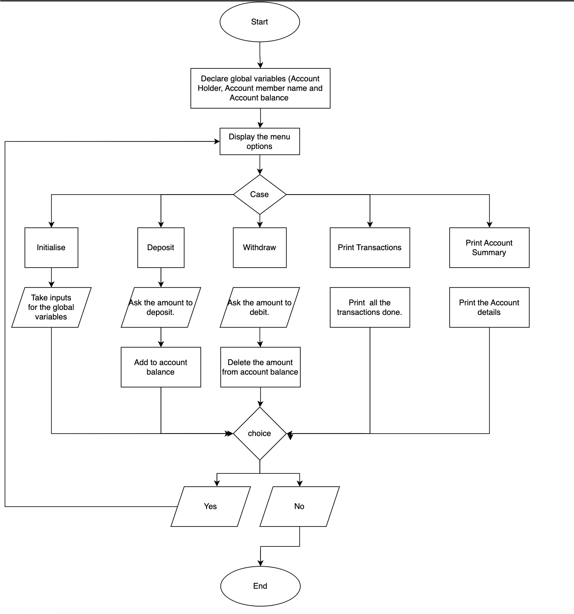

QUESTION 
Write a JAVA Menu driven program that does the following: 
You can ONLY have the below variables as global variables 
Account Number 
Account Holder Name 
Account Balance 
You MUST have the below as functions 
To initialize the customer 
To deposit money 
To withdraw money 
To print the transactions 
To print account summary 
Your menu will have the following operations once the customer is created 
To deposit money 
To withdraw money 
To print the transactions 
To print account summary 
 
 
Algorithm:
1. Create the global variable Account number, Account holder name, Account balance. 
2. Create the initcustomer method which will take the inputs for all the global variables. 
3. Initialize the following variables:is the integer variable which holds the amount which user wants to deposit. 
    - amount (is the integer variable which holds the amount which user wants to deposit) 
    - opt (is the integer variable which holds the user option for choosing the menu options) 
    - choice (is the char variable which will store the user input of continuing the task) 
    - transaction_details (is the String array which stores the transaction details which includes timestamp) 
    - Initialize count as 0 (It is the integer variable which will keep a count on the transaction and to store the transaction details in the transaction_details array) 
    - values (is the String which is used to store the returned value by the functions) 
    - arr (is the string array which will split the values string and stores in it.) 
4. Create the deposit function as: 
    - The deposit function should take amount, transaction_details, timestamp, count and values as parameters 
    - Add the amount to the Account balance and store the transaction details in the transaction_details array. 
    - Convert the Accountbalance to string and concat it with the transaction_details and store it in the values array. 
    - return the values array. 
5. Create the withdraw function as: 
    - The withdraw function should take amount, transaction_details, timestamp, count and values as parameters 
    - Check if the amount is greater than the Account balance. 
    - If it is greater then print a message as insufficient funds. 
    - Else subract the amount from the Account balance and store the transaction details in the transaction_details array. 
    - Convert the Accountbalance to string and concat it with the transaction_details and store it in the values array. 
    - return the values array. 
6. Create the transactions function as: 
    - Use a for loop to print the transaction_details array. 
7. Create the accountSummary function as: 
    - It will print the details of the customer that includes the Account number, Account holder name, Account balance. 
8. Create the main method as:
    - Initialize the customer using the initcustomer method which will ask for the input for the global variables. 
    - Perform a do while loop to perform the operation till the user's choice of quit. 
    - Create a timestamp variable of Timestamp class to keep a note of the transaction time for each transaction. 
    - Now Display the 4 options Deposit, Withdraw, Print Transactions and Account summary. 
    - Use a switch case to perform cases. 
    - Now if user choose 1 then: 
        - Ask for the amount to deposit and store it the amount variable. 
        - Call the deposit function by passing the amount, transaction_details, timestamp, count, values as parameters and assign it to values 
        - Now split the values variable using the '+' as seperator and assing it to the arr array. 
        - Assign the Account balance as the arr array of '0' position. 
        - Assign the transaction_details of the count position as the arr array of the '1'st position. 
        - increase the count by 1. 
    - If user choose 2 then: 
        - Ask for the amount to Withdraw and store it the amount variable. 
        - Call the withdraw function by passing the amount, transaction_details, timestamp, count, values as parameters and assign it to values 
        - Now split the values variable using the '+' as seperator and assing it to the arr array. 
        - Assign the Account balance as the arr array of '0' position. 
        - Assign the transaction_details of the count position as the arr array of the '1'st position. 
        - increase the count by 1. 
    - If user choose 3 then: 
        - Call the transactions function. 
    - If user choose 4 then: 
        - Call the accountSummary function. 
    - If user enters any other number then: 
        - Display a message that the entered option is wrong. 
    - Ask the user whether his wish to continue or exit: 
        - If he enters 'y' or 'Y' then continue the loop. 
        - If he enters any other letter then end the loop. 

 
 
SAMPLE OUTPUT: 

BANKING 
******* 
Initialize the customer 
Enter the Account number:  
123456789 
Enter the Account holder name:  
Chendra Kanth 
Enter the Account balance:  
100000 
You have successfully initialized the customer. 
 
Menu Options 
1. Deposit Money 
2. Withdraw Money 
3. Transactions 
4. Account summary 
 
Please enter your option:  
1 
Enter the amount you want to deposit. 
100000 
DEPOSIT 
******* 
You have successfully deposited the amount 
 
Do you want to continue, 'y' or 'n'  
y 
 
Menu Options 
1. Deposit Money 
2. Withdraw Money 
3. Transactions 
4. Account summary 
 
Please enter your option:  
1 
Enter the amount you want to deposit. 
10000 
DEPOSIT 
******* 
You have successfully deposited the amount 
 
Do you want to continue, 'y' or 'n'  
y 

Menu Options 
1. Deposit Money 
2. Withdraw Money 
3. Transactions 
4. Account summary 
 
Please enter your option:  
2 
Enter the amount you want to withdraw. 
50000 
Withdraw 
******** 
Your Withdrawl is successfull. 
 
Do you want to continue, 'y' or 'n'  
y 
 
Menu Options 
1. Deposit Money 
2. Withdraw Money 
3. Transactions 
4. Account summary 
 
Please enter your option:  
2 
Enter the amount you want to withdraw. 
170000 
Withdraw 
******** 
Insufficient funds. 
 
Do you want to continue, 'y' or 'n'  
y 
 
Menu Options 
1. Deposit Money 
2. Withdraw Money 
3. Transactions 
4. Account summary 
 
Please enter your option:  
3 
Transactions 
************ 
2023-02-22 17:29:34.615 100000 Deposited, Available balance is 200000.0 
2023-02-22 17:29:45.557 10000 Deposited, Available balance is 210000.0 
2023-02-22 17:29:58.759 50000 Withdraw, Available balance is 160000.0 
[Ljava.lang.String;@7ea987ac 
End of the Transactions. 
 
Do you want to continue, 'y' or 'n'  
y 
 
Menu Options 
1. Deposit Money 
2. Withdraw Money 
3. Transactions 
4. Account summary 
 
Please enter your option:  
4 
Account Summary 
*************** 
Account Number: 123456789 
Account Holder Name: Chendra Kanth 
Account Balance: 160000.0 
 
Do you want to continue, 'y' or 'n'  
n 

 
FLOW CHART:
 

