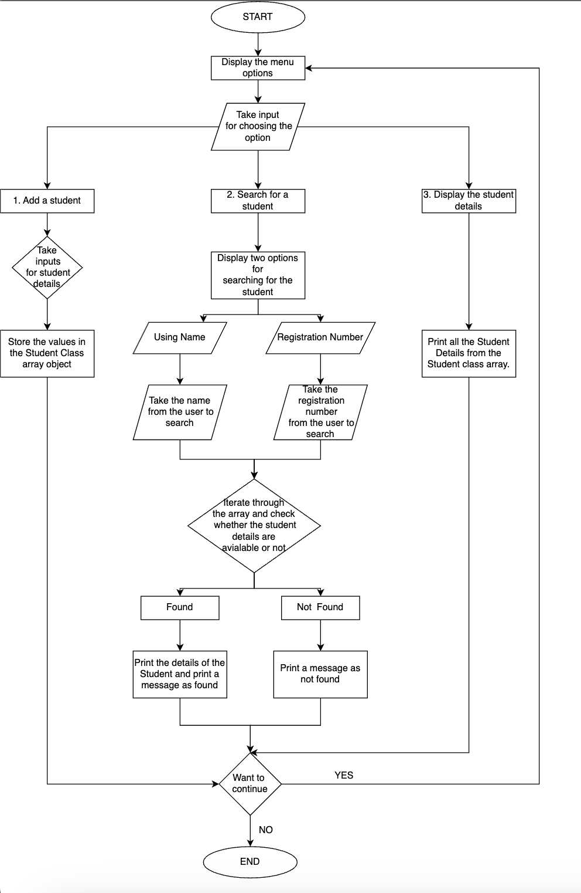

QUESTION: 
--------- 
Create a student class, that will store the details of the Student 
Reg. No. 
Name 
Email 
Phone 
Class 
Department 
The class will have a constructor to initialize the values of the Student and a method to print the Details of the Student. 
In the main-method class, create an array of Student Class to hold maximum details of 100 Students. 
In the menu-driven program, the menu options will have 
Add a student 
Adds the details of 1 student to the array of Student 
Search for a student 
Search for the details of a student from the array of Student 
(Optional) Searching can be done with Name & Register Number  
Display all students 
Displays the details of all students 

SOLUTION 
-------- 
- First Create a Student Class and Declare the variables "Name", "RegNo", "Class", "Department", "Email", "Phonenumber".  
- Create a parameterised constructor for the Student class with the parameters "Name", "RegNo", "Class", "Department", "Email", "Phonenumber".  
- Assign the parameter values to the declared variables using "this" keyword.  
- Create a "print" method which will print the details of the student i.e., ("Name", "RegNo", "Class", "Department", "Email", "Phonenumber")  
 
 
 
- Now create a main class, and create a scanner class object to take inputs. 
- Create a integer variable counter and intialise it to zero. This counter variable is used to keep count of the number of inputs in the array. 
- Inside the main method, Create a Student class array of length 100. 
- Declare a character variable choice and intialise to 'n' 
- Create a Do while loop which will perform till the users choice wants to exit. 
- Inside the do while loop do the following 
    1. Print the options for the user (add/search/display) 
    2. If user chooses the option as 1, then call addStudent() method and pass a parameter Student class array. 
    3. If user chooses the option as 2, then call searchStudent() method and pass a parameter Student class array. 
    4. If user chooses the option as 3, then call displayStudent() method and pass a parameter Student class array. 
- Create a method as addStudent with a Student class array as the parameter 
    - In this method take all the inputs for the student details. 
    - Now store all the inputs in the students class array and increase the counter variable by 1. 
- Create a method as searchStudent with a Student class array as the parameter 
    - In this method you will provide the user with two options to search for the required student 
        1. Using Name 
        2. Using Registration Number. 
    - Take the input from the user for choosing the option and save it in opt variable. 
    - If he choose "1" , Ask the student name he wants to search and then start a loop to iterate through the array object and inside the loop give a condition to check the entered name and the name in the array object. If they are equal then print the details of the student and print a message as student found. If you dint find the required student then print a message as not found. 
    - If he choose "2", Ask the register number then start a loop to iterate through the array object and inside the loop give a condition to check the entered registered number and the registered number in the array object. If they are equal then print the details of the student and print a message as student found. If you dint find the required student then print a message as not found. 
- Create a method as displayStudent with a Student class array as the parameter 
    - Print all the students details by iterating through the array. 
 
 
OUTPUT: 
------  

 
MENU 
1. Add Student 
2. Search For a Student 
3. Display The Details Of a Student 
1 
ADDING A STUDENT: 
Name:  
Chendra kanth 
Email:  
peddapuramkanth@gmail.com 
Registration Number:  
22122138 
Class:  
MSCDS B 
Department:  
Data Science 
Phone Number:  
6301471234 
Do You Want to Exit?? 
n 
MENU 
1. Add Student 
2. Search For a Student 
3. Display The Details Of a Student 
2 
How Do you want to search for a student: 
1. Name 
2. Registration Number 
1 
Enter the name of the student you want to search 
Vaishnavi priya 
The student with the details provided is not found!! 
Do You Want to Exit?? 
n 
MENU 
1. Add Student 
2. Search For a Student 
3. Display The Details Of a Student 
1 
ADDING A STUDENT: 
Name:  
Vaishnavi Priya 
Email:  
vvpriaya33@gmail.com 
Registration Number:  
22122180  
Class:  
MSCEA 
Department:  
Data Science 
Phone Number:  
123630163 
Do You Want to Exit?? 
n 
MENU 
1. Add Student 
2. Search For a Student 
3. Display The Details Of a Student 
2 
How Do you want to search for a student: 
1. Name 
2. Registration Number 
2 
Enter the registration number of the student you want to search 
22122170 
The student with the details provided is not found!! 
Do You Want to Exit?? 
n 
MENU 
1. Add Student 
2. Search For a Student 
3. Display The Details Of a Student 
1 
ADDING A STUDENT: 
Name:  
Keshav 
Email:  
keshavreddy010@gmail.com 
Registration Number:  
22122170 
Class:  
BBA  
Department:  
BBA 
Phone Number:  
9550123456 
Do You Want to Exit?? 
n 
MENU 
1. Add Student 
2. Search For a Student 
3. Display The Details Of a Student 
2 
How Do you want to search for a student: 
1. Name 
2. Registration Number 
1 
Enter the name of the student you want to search 
keshav 
---------------------------------------- 
Name: Keshav 
Registration Number: 22122170 
Email: keshavreddy010@gmail.com 
Class: BBA  
Department: BBA 
Phone Number: 9550123456 
These are the requested student details!!!!!! 
Do You Want to Exit?? 
n 
MENU 
1. Add Student 
2. Search For a Student 
3. Display The Details Of a Student 
2 
How Do you want to search for a student: 
1. Name 
2. Registration Number 
2 
Enter the registration number of the student you want to search 
22122180 
---------------------------------------- 
Name: Vaishnavi Priya 
Registration Number: 22122180 
Email: vvpriaya33@gmail.com 
Class: MSCEA 
Department: Data Science 
Phone Number: 123630163 
These are the requested student details!!!!!! 
Do You Want to Exit?? 
n 
MENU 
1. Add Student 
2. Search For a Student 
3. Display The Details Of a Student 
3 
************STUDENT DETAILS************ 
---------------------------------------- 
Name: Chendra kanth 
Registration Number: 22122138 
Email: peddapuramkanth@gmail.com 
Class: MSCDS B 
Department: Data Science 
Phone Number: 6301471234 
---------------------------------------- 
Name: Vaishnavi Priya 
Registration Number: 22122180 
Email: vvpriaya33@gmail.com 
Class: MSCEA 
Department: Data Science 
Phone Number: 123630163 
---------------------------------------- 
Name: Keshav 
Registration Number: 22122170 
Email: keshavreddy010@gmail.com 
Class: BBA  
Department: BBA 
Phone Number: 9550123456 
Do You Want to Exit?? 
y 
 
 
 
FLOWCHART:
 

