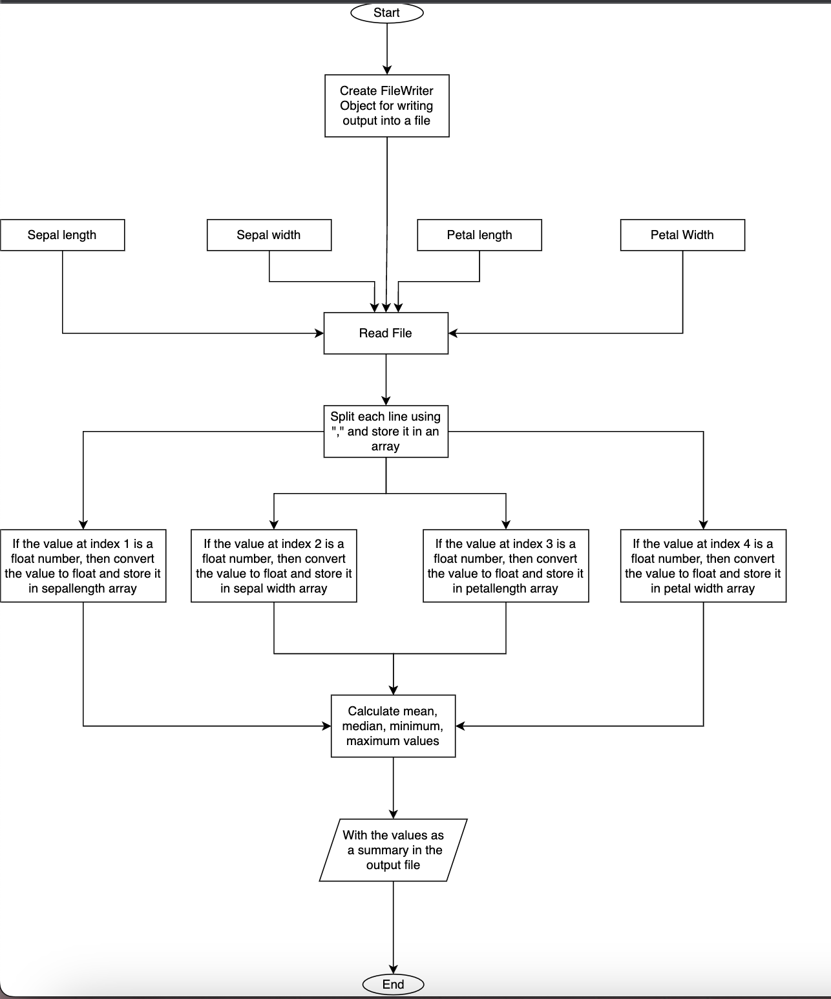

QUESTION: 
1. Create a new folder in git named 'Lab 7' for the following question and solve the following: create a flowchart and document the results, constraints, etc., in the README.md file for the lab. 
2. Given the famous iris dataset, find the 5-point summary [Mean, Median, Mode, Min, Max] for the attributes: SepalLengthCm, SepalWidthCm, PetalLengthCm, PetalWidthCm. 
3. Once the overall summary statistics have been calculated, identify the summary statistics for each Species of iris flower [Iris-setosa, Iris-versicolor, Iris-virginica]. 
4. Present your results in the appropriate format and write the results in a file. 
 
SOLUTION: 
********** 

1. Create new Folder and add 3 folders Dataset, Images, Output. The Dataset folder contains the dataset of the iris flower, The Images folder will contain the flowchart of the problem and the Output folder contains the text file named "output.txt" which contains the output of the program after execution. 
 
2. Explanation of Code: 
 
- In the main method create a new file object and mention the specific path. 
- Now create a new file using the file object for saving the output. 
- Create a FileWriter object for writing the outputs in the output file. 
- Now call the following functions  
    1. readFile: 
        1. Create a variable length and assign it to 0, This variable is used to create arrays of the length value. 
        2. Use try block and define the following: 
            Create a File object and give the dataset path. 
            Create a Scanner class object to read the file. 
            Use a while loop to read the file untill it has the next line and increase the length value by 1 if it has a next line. 
            Close the Scanner class object
        3. Use catch block to catch if any exception is occured and print the error message. 
        4. Return the length.
    2. sepalLen: 
        1. This function will accept a parameter of type FileWriter. 
        2. Call the readFile function and assign the returned value to a variable length. 
        3. Create a float type array sepallength of the length "length". 
        4. Now inside a try block, create a object of File class and an object of scanner class and declare a variable count and initialise it to zero. 
        5. Now use a while loop to read the file till it has a next line. 
            Inside the while loop split the current line using "," as a separator and assign it to a astring array called line 
            If the value at index "1" in the line array matches the float value regular expression then: 
                Convert the value of line array at position "1" to float and assign to the sepallength array at the value of count position. 
                Increase the count by 1. 
        6. Close the scanner class object. 
        7. Use catch block to catch if any exception is occured and print the error message. 
        8. Now use another try block for writing the output in the output file. 
        9. Inside the try using the FileWriter object which is passed as a parameter, write the Summary( mean, median, mode, minimum, maximum) values in the output file. 
        10. Use catch block to catch if any exception is occured and print the error message. 
    3. sepalWidth: 
        1. This function will accept a parameter of type FileWriter. 
        2. Call the readFile function and assign the returned value to a variable length. 
        3. Create a float type array sepalwidth of the length "length". 
        4. Now inside a try block, create a object of File class and an object of scanner class and declare a variable count and initialise it to zero. 
        5. Now use a while loop to read the file till it has a next line. 
            Inside the while loop split the current line using "," as a separator and assign it to a astring array called line 
            If the value at index "2" in the line array matches the float value regular expression then: 
                Convert the value of line array at position "2" to float and assign to the sepalwidth array at the value of count position. 
                Increase the count by 1. 
        6. Close the scanner class object. 
        7. Use catch block to catch if any exception is occured and print the error message. 
        8. Now use another try block for writing the output in the output file. 
        9. Inside the try using the FileWriter object which is passed as a parameter, write the Summary( mean, median, mode, minimum, maximum) values in the output file. 
        10. Use catch block to catch if any exception is occured and print the error message. 
    4. petalLength: 
        1. This function will accept a parameter of type FileWriter. 
        2. Call the readFile function and assign the returned value to a variable length. 
        3. Create a float type array petallength of the length "length". 
        4. Now inside a try block, create a object of File class and an object of scanner class and declare a variable count and initialise it to zero. 
        5. Now use a while loop to read the file till it has a next line. 
            Inside the while loop split the current line using "," as a separator and assign it to a astring array called line 
            If the value at index "3" in the line array matches the float value regular expression then: 
                Convert the value of line array at position "3" to float and assign to the petallength array at the value of count position. 
                Increase the count by 1. 
        6. Close the scanner class object. 
        7. Use catch block to catch if any exception is occured and print the error message. 
        8. Now use another try block for writing the output in the output file. 
        9. Inside the try using the FileWriter object which is passed as a parameter, write the Summary( mean, median, mode, minimum, maximum) values in the output file. 
        10. Use catch block to catch if any exception is occured and print the error message. 
    5. petalWidth: 
        1. This function will accept a parameter of type FileWriter. 
        2. Call the readFile function and assign the returned value to a variable length. 
        3. Create a float type array petalwidth of the length "length". 
        4. Now inside a try block, create a object of File class and an object of scanner class and declare a variable count and initialise it to zero. 
        5. Now use a while loop to read the file till it has a next line. 
            Inside the while loop split the current line using "," as a separator and assign it to a astring array called line 
            If the value at index "4" in the line array matches the float value regular expression then: 
                Convert the value of line array at position "4" to float and assign to the petalwidth array at the value of count position. 
                Increase the count by 1. 
        6. Close the scanner class object. 
        7. Use catch block to catch if any exception is occured and print the error message. 
        8. Now use another try block for writing the output in the output file. 
        9. Inside the try using the FileWriter object which is passed as a parameter, write the Summary( mean, median, mode, minimum, maximum) values in the output file. 
        10. Use catch block to catch if any exception is occured and print the error message. 
- The summary( mean, median, mode, minimum, maximum) is calculated using the below functions: 
    1. mean: 
        It calculates mean of the integer array using the formula of (sum of observations) / (total number of observations) 
    2. median: 
        1. It will sort the array 
        2. Checks the length of the array 
        3. If the value is odd then the middle value is the median and if the length of the array is even then the median is the average of the two middle values. 
    3. mode: 
        1. Intialise maxcount and maxvalue to zero 
        2. Now run a loop where each element will be checked with every element of the array, 
        3. which element is repeated for more number of times will be assigned to the maxvalue and the particular count will be assigned to the max count. 
        4. Now after the execution of loops the final maxvalue will be the median value. 
    4. min: 
        1. Assign the first value as minimum value and iterate through the loop and compare the elements with the minimum value 
        2. If any element is lesser than the minimum value, then assign the respective element as the minimum value. 
    5. max: 
        1. Assign the first value as maximum value and iterate through the loop and compare the elements with the maximum value 
        2. If any element is greater than the maximum value, then assign the respective element as the maximum value. 
 
 

OUTPUT: 
-------- 
The output will be saved in the output file in the Lab7 folder. 
 
 
Flowchart: 
--------- 
